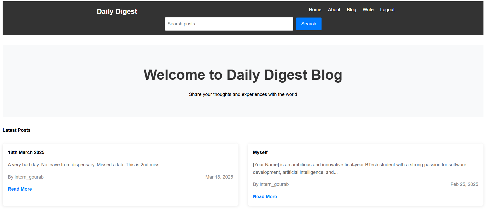

# Welcome to Our Blogging Platform - DAILY DIGEST!

Discover, create, and share your thoughts with the world on our dynamic blogging platform! Whether you're an aspiring writer, a seasoned blogger, or someone who loves reading insightful content, we provide a seamless and user-friendly experience for all.

## ✨ What We Offer:

- **Write & Publish:** Express yourself by creating and publishing your own blog posts.
- **Engage & Connect:** Interact with a community of like-minded individuals through discussions and comments.
- **Secure & Personalized:** Enjoy a safe and personalized blogging experience with user authentication and profile management.
- **Search & Explore:** Find inspiring content using advanced search filters, including author names, keywords, and date ranges.

Join us today and become a part of a vibrant blogging community where ideas flow freely, and creativity knows no bounds! 🚀

---

## 🖼 Frontend Preview



> *Screenshot of the homepage of Daily Digest.*

---

## 🛠 Requirements

- Python 3.7+
- Flask
- Flask-SQLAlchemy
- Flask-Login
- Werkzeug

## 🚀 Getting Started

1. **Clone the repository:**
    ```sh
    git clone https://github.com/your-username/daily-digest.git
    cd daily-digest
    ```

2. **Create a virtual environment:**
    ```sh
    python -m venv venv
    ```

3. **Activate the virtual environment:**
    - On Windows:
        ```sh
        venv\Scripts\activate
        ```
    - On macOS/Linux:
        ```sh
        source venv/bin/activate
        ```

4. **Install the dependencies:**
    ```sh
    pip install -r requirements.txt
    ```

5. **Set up the database:**
    ```sh
    flask db init
    flask db migrate -m "Initial migration."
    flask db upgrade
    ```

6. **Run the application:**
    ```sh
    flask run
    ```

7. **Open your browser and visit:**
    ```
    http://127.0.0.1:5000
    ```

---

## 🔧 Technical Features

### Features included:

- **User registration and login**
- **Password hashing**
- **User authentication**
- **Protected routes (write and logout)**
- **User registration with validation**
- **Error-free database operations**
- **Secure password handling**
- **Proper template rendering**

### The website will be fully functional with:

- **User registration/login**
- **Blog post creation**
- **Search functionality**
- **Author attribution**
- **Responsive design**
- **Clean typography**
- **Interactive elements**
- **Consistent styling across all pages**

### You can now run `flask run` and test all the features:

- **Register a new user**
- **Create posts**
- **Search for content**
- **View all posts on blog page**
- **Read individual posts**
- **View about page**
- **Logout functionality**

---

## 📄 License

This project is licensed under the MIT License - see the [LICENSE](LICENSE) file for details.
